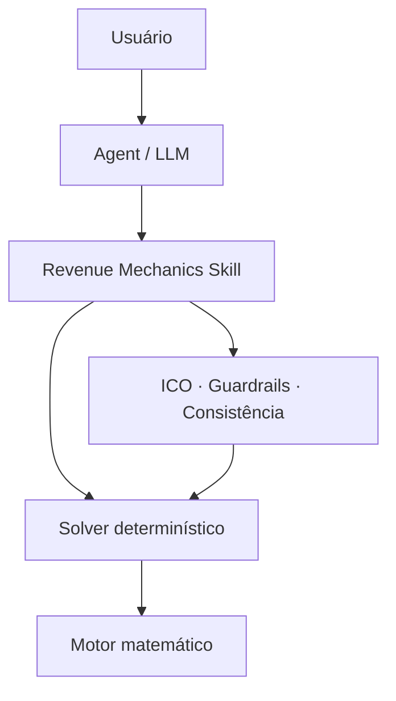

<h1 align="center">Revenue Agentic</h1>

<p align="center">
  <strong>Análise, diagnóstico e planejamento reverso de receita com IA — sem delegar a matemática ao LLM.</strong>
</p>

<p align="center">
  Powered by <strong>Revenue Mechanics / Equações Bonfarianas</strong>
</p>

<p align="center">
  
  
  
  
  
</p>

<p align="center">
  <a href="#visão-geral">Visão geral</a> ·
  <a href="#arquitetura">Arquitetura</a> ·
  <a href="#início-rápido">Início rápido</a> ·
  <a href="#núcleo-matemático">Matemática</a> ·
  <a href="#confiabilidade">Confiabilidade</a> ·
  <a href="#documentação">Documentação</a>
</p>

---

> [!IMPORTANT]
> **O modelo de linguagem interpreta; o motor Python calcula.** O agente entende a pergunta, seleciona o workflow e explica a decisão. Toda aritmética de produção passa pelo solver determinístico, pelos guardrails e pelos checks de consistência.

## Visão geral

**Revenue Agentic** é um agente para decompor métricas, diagnosticar gargalos e transformar metas de receita em variáveis operacionais. Seu núcleo é a **Revenue Mechanics Agent Skill**, uma capacidade reutilizável que combina conhecimento procedural, equações auditáveis e código determinístico.

A versão 2 substitui uma coleção de fórmulas isoladas por uma pequena **álgebra geradora**. Ela permite percorrer o sistema nos dois sentidos:

| Diagnóstico | Planejamento reverso |
| --- | --- |
| Resultado → decomposição → gargalo → alavanca | Meta → variáveis necessárias → limites → plano |

O princípio gerador do framework é:

```math
\boxed{\text{Resultado}=\text{Volume}\times\text{Probabilidades}\times\text{Valor}}
```

### O que o produto resolve

- decomposição de aquisição paga, funis, CRO, ecommerce, B2B e receita recorrente;
- cálculo reverso de metas, taxas mínimas e custos máximos admissíveis;
- auditoria de métricas conflitantes com `Consistency Score` e tiers;
- análise de eficiência marginal com proteção contra mudanças estruturais;
- priorização de alavancas com confiabilidade e premissas explícitas;
- execução JSON-in/JSON-out para agentes, automações e pipelines.

## Arquitetura

O design é **skill-first + motor determinístico + agente opcional**.



| Camada | Responsabilidade | Implementação |
| --- | --- | --- |
| **Revenue Agentic** | Interpretar o problema e comunicar a decisão | [`agent/revenue_mechanics_agent.py`](agent/revenue_mechanics_agent.py) |
| **Agent Skill** | Escolher workflow, exigir inputs e aplicar regras | [`skills/revenue-mechanics/SKILL.md`](skills/revenue-mechanics/SKILL.md) |
| **Solver** | Receber JSON, calcular e devolver JSON auditável | [`revenue_solver.py`](skills/revenue-mechanics/scripts/revenue_solver.py) |
| **Motor** | Executar identidades, guards e consistency checks | [`revenue_mechanics.py`](revenue_mechanics.py) |
| **Confiabilidade** | Registrar ICO, tier e escopo permitido | [`reliability_registry.py`](reliability_registry.py) |

Essa separação evita que cálculos dependam do raciocínio probabilístico do LLM. O agente é uma camada de orquestração; a skill e o código são a fonte operacional de verdade.

## Início rápido

### Requisitos

- Python 3.10 ou superior;
- nenhuma dependência externa para o núcleo determinístico;
- `openai-agents>=0.14.0` somente para o runner opcional.

### 1. Clone e valide

```bash
git clone https://github.com/paulobonfa/revenue-agentic.git
cd revenue-agentic
python scripts/validate_production.py
```

### 2. Execute o solver

```bash
python skills/revenue-mechanics/scripts/revenue_solver.py \
  media-funnel \
  --input skills/revenue-mechanics/assets/example_input.json
```

O resultado é devolvido em JSON com cálculo, classificação de confiabilidade, premissas e alertas aplicáveis.

### Workflows disponíveis

| Modo | Aplicação |
| --- | --- |
| `media-funnel` | Decompor mídia paga de orçamento/CPM até receita e CAC |
| `reverse-funnel` | Calcular volume inicial ou conversão necessária para uma meta |
| `cro-target` | Resolver crescimento por uma ou várias alavancas de conversão |
| `ecommerce` | Decompor sessões, CVR, itens, preço e receita |
| `b2b` | Traduzir meta de bookings em oportunidades, deals e pipeline |
| `subscription` | Projetar base ativa, MRR e unit economics condicionais |
| `scale` | Medir eficiência marginal entre períodos comparáveis |
| `consistency` | Confrontar valores observados e derivados antes da análise |

Consulte exemplos completos em [`WORKFLOWS.md`](skills/revenue-mechanics/references/WORKFLOWS.md).

## Núcleo matemático

As oito famílias abaixo formam a base geradora do sistema.

### 1. Fluxo

Cada etapa recebe o volume anterior multiplicado pela probabilidade de avanço:

```math
N_{i+1}=N_i\,p_i
```

Para uma cadeia completa de $n$ etapas:

```math
N_n=N_0\prod_{i=0}^{n-1}p_i
```

### 2. Custo entre etapas

O custo unitário cresce inversamente à taxa de passagem:

```math
c_{i+1}=\frac{c_i}{p_i}
```

### 3. Valor econômico esperado

O valor esperado de uma etapa é o valor posterior ponderado pela probabilidade de avanço:

```math
V_i=p_i\,V_{i+1}
```

### 4. Receita transacional

```math
\operatorname{Revenue}=\operatorname{Outcome}\times\operatorname{AverageValue}
```

### 5. Aquisição paga

```math
\operatorname{Impressions}=\frac{1000\times\operatorname{Budget}}{CPM}
```

### 6. Estado ou estoque

```math
\operatorname{Stock}_t=\operatorname{Stock}_{t-1}+\operatorname{Inflows}_t-\operatorname{Outflows}_t
```

### 7. Crescimento multiplicativo

```math
\frac{Y_1}{Y_0}=\prod_i\left(\frac{x_{i,1}}{x_{i,0}}\right)^{a_i}
```

### 8. Eficiência marginal observada

```math
mCost=\frac{\Delta Cost}{\Delta Outcome}
```

> [!CAUTION]
> `mCost`, `mCAC` e `mROAS` só representam eficiência marginal de escala quando os períodos são operacionalmente comparáveis. O solver bloqueia essa interpretação se houver mudança estrutural declarada.

## Exemplo: de CPM até CAC

Considere $q=\mathrm{Sessions}/\mathrm{Clicks}$. A cadeia de custo pode ser decomposta assim:

```math
\begin{aligned}
CPC &= \frac{CPM}{1000\times CTR} \\
CPS &= \frac{CPC}{q} \\
CPL &= \frac{CPS}{CVR_{S,L}} \\
CAC_{\text{mídia}} &= \frac{CPL}{CVR_{L,C}}
\end{aligned}
```

Substituindo cada etapa pela anterior:

```math
\boxed{
CAC_{\text{mídia}}=
\frac{CPM}
{1000\times CTR\times q\times CVR_{S,L}\times CVR_{L,C}}
}
```

A mesma identidade pode ser invertida para encontrar **CPL máximo**, **CPC máximo**, **CPM máximo** ou a **conversão mínima** compatível com a economia final do negócio.

## Confiabilidade

O **ICO — Índice de Confiabilidade Operacional** não representa probabilidade de acurácia futura. Ele governa o uso de cada família com base em validade matemática, robustez dos dados, validação externa, estabilidade das premissas e utilidade operacional.

| Tier | Faixa | Uso permitido |
| --- | ---: | --- |
| **CORE_A** | ≥ 95 | Identidade e diagnóstico liberados para produção |
| **CORE_B** | 90–94,99 | Planejamento condicionado com premissas explícitas |
| **CONDITIONAL** | 80–89,99 | Uso restrito, com avisos e escopo declarado |
| **EXPERIMENTAL** | < 80 | Fora do produto principal |

### Gate atual

| Verificação | Resultado |
| --- | ---: |
| Testes automatizados | **36/36** |
| Workflows do solver | **8/8** |
| Stress test | **20.000 cenários** |
| Erro máximo entre identidades | **5,615 × 10⁻¹⁶** |
| ICO — Core A | **98,18/100** |
| ICO — Core A+B | **95,96/100** |
| Production gate local | **PASS** |

Execute o mesmo gate a qualquer momento:

```bash
python scripts/validate_production.py
```

## O que mudou na v2

Foram removidos do core os modelos que não atingiram o gate de produção ou exigiam sofisticação desproporcional ao ICP, incluindo a antiga curva logarítmica de saturação, ARR triangular, `RC = T × (1 − churn)` e LTV triangular.

Entraram no lugar:

- cadeia universal de fluxo, custo e valor econômico esperado;
- Revenue/CRO solver reversível;
- base ativa e MRR modelados como estado/fluxo;
- MRR bridge, GRR e NRR;
- elasticidade-arco para intervalos discretos;
- consistência automática entre métricas;
- classificação de confiabilidade por família.

## Documentação

| Documento | Conteúdo |
| --- | --- |
| [`SKILL.md`](skills/revenue-mechanics/SKILL.md) | Contrato operacional da Agent Skill |
| [`AGENT_ARCHITECTURE.md`](docs/AGENT_ARCHITECTURE.md) | Benchmarking e decisão arquitetural |
| [`MATHEMATICAL_SPEC.md`](docs/MATHEMATICAL_SPEC.md) | Especificação matemática completa |
| [`VALIDATION_REPORT.md`](docs/VALIDATION_REPORT.md) | Evidências, confrontos e limites |
| [`PRODUCTION_GATES.md`](docs/PRODUCTION_GATES.md) | Critérios de aprovação para produção |
| [`GUARDRAILS.md`](skills/revenue-mechanics/references/GUARDRAILS.md) | Proteções contra interpretações inválidas |
| [`CHANGELOG.md`](CHANGELOG.md) | Histórico de mudanças |

## Escopo deliberado

Revenue Agentic não tenta substituir MMM, modelos bayesianos, inferência causal ou forecasting financeiro avançado. Essas abordagens podem ser apropriadas em operações maiores, mas não são necessárias para a maioria das decisões do ICP do framework.

> **Regra de parcimônia:** complexidade só entra quando reduz materialmente o erro da decisão.

## Licença

Distribuído sob a licença [Creative Commons Attribution-ShareAlike 4.0](LICENSE.txt).

---

<p align="center">
  <strong>Revenue Agentic</strong> · decisões explicáveis, matemática auditável.
</p>
