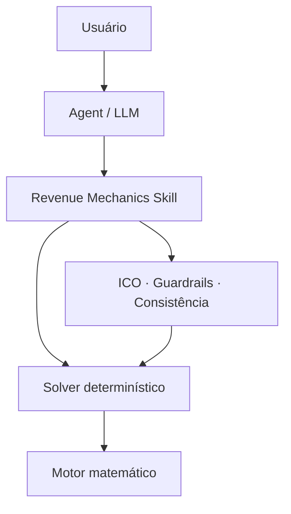

<h1 align="center">Revenue Agentic</h1>

<p align="center">
  <strong>Análise, diagnóstico e planejamento reverso de receita com IA — sem delegar a matemática ao LLM.</strong>
</p>

<p align="center">
  Powered by <strong>Revenue Mechanics / Equações Bonfarianas</strong>
</p>

<p align="center">
  
  
  
  
  
</p>

<p align="center">
  <a href="#visão-geral">Visão geral</a> ·
  <a href="#arquitetura">Arquitetura</a> ·
  <a href="#início-rápido">Início rápido</a> ·
  <a href="#aula-completa-revenue-mechanics-do-zero">Aula completa</a> ·
  <a href="#confiabilidade">Confiabilidade</a> ·
  <a href="#documentação">Documentação</a>
</p>

---

> [!IMPORTANT]
> **O modelo de linguagem interpreta; o motor Python calcula.** O agente entende a pergunta, seleciona o workflow e explica a decisão. Toda aritmética de produção passa pelo solver determinístico, pelos guardrails e pelos checks de consistência.

## Visão geral

**Revenue Agentic** é um agente para decompor métricas, diagnosticar gargalos e transformar metas de receita em variáveis operacionais. Seu núcleo é a **Revenue Mechanics Agent Skill**, uma capacidade reutilizável que combina conhecimento procedural, equações auditáveis e código determinístico.

A versão 2 substitui uma coleção de fórmulas isoladas por uma pequena **álgebra geradora**. Ela permite percorrer o sistema nos dois sentidos:

| Diagnóstico | Planejamento reverso |
| --- | --- |
| Resultado → decomposição → gargalo → alavanca | Meta → variáveis necessárias → limites → plano |

O princípio gerador do framework é:

```math
\boxed{\text{Resultado}=\text{Volume}\times\text{Probabilidades}\times\text{Valor}}
```

### O que o produto resolve

- decomposição de aquisição paga, funis, CRO, ecommerce, B2B e receita recorrente;
- cálculo reverso de metas, taxas mínimas e custos máximos admissíveis;
- auditoria de métricas conflitantes com `Consistency Score` e tiers;
- análise de eficiência marginal com proteção contra mudanças estruturais;
- priorização de alavancas com confiabilidade e premissas explícitas;
- execução JSON-in/JSON-out para agentes, automações e pipelines.

## Arquitetura

O design é **skill-first + motor determinístico + agente opcional**.



| Camada | Responsabilidade | Implementação |
| --- | --- | --- |
| **Revenue Agentic** | Interpretar o problema e comunicar a decisão | [`agent/revenue_mechanics_agent.py`](agent/revenue_mechanics_agent.py) |
| **Agent Skill** | Escolher workflow, exigir inputs e aplicar regras | [`skills/revenue-mechanics/SKILL.md`](skills/revenue-mechanics/SKILL.md) |
| **Solver** | Receber JSON, calcular e devolver JSON auditável | [`revenue_solver.py`](skills/revenue-mechanics/scripts/revenue_solver.py) |
| **Motor** | Executar identidades, guards e consistency checks | [`revenue_mechanics.py`](revenue_mechanics.py) |
| **Confiabilidade** | Registrar ICO, tier e escopo permitido | [`reliability_registry.py`](reliability_registry.py) |

Essa separação evita que cálculos dependam do raciocínio probabilístico do LLM. O agente é uma camada de orquestração; a skill e o código são a fonte operacional de verdade.

## Início rápido

### Requisitos

- Python 3.10 ou superior;
- nenhuma dependência externa para o núcleo determinístico;
- `openai-agents>=0.14.0` somente para o runner opcional.

### 1. Clone e valide

```bash
git clone https://github.com/paulobonfa/revenue-agentic.git
cd revenue-agentic
python scripts/validate_production.py
```

### 2. Execute o solver

```bash
python skills/revenue-mechanics/scripts/revenue_solver.py \
  media-funnel \
  --input skills/revenue-mechanics/assets/example_input.json
```

O resultado é devolvido em JSON com cálculo, classificação de confiabilidade, premissas e alertas aplicáveis.

### Workflows disponíveis

| Modo | Aplicação |
| --- | --- |
| `media-funnel` | Decompor mídia paga de orçamento/CPM até receita e CAC |
| `reverse-funnel` | Calcular volume inicial ou conversão necessária para uma meta |
| `cro-target` | Resolver crescimento por uma ou várias alavancas de conversão |
| `ecommerce` | Decompor sessões, CVR, itens, preço e receita |
| `b2b` | Traduzir meta de bookings em oportunidades, deals e pipeline |
| `subscription` | Projetar base ativa, MRR e unit economics condicionais |
| `scale` | Medir eficiência marginal entre períodos comparáveis |
| `consistency` | Confrontar valores observados e derivados antes da análise |

Consulte exemplos completos em [`WORKFLOWS.md`](skills/revenue-mechanics/references/WORKFLOWS.md).

## Aula completa: Revenue Mechanics do zero

Esta seção ensina o raciocínio do framework, não apenas suas fórmulas. A ideia central é sair de métricas isoladas e enxergar receita como um sistema de **volume, passagem, valor e tempo**.

> [!NOTE]
> Os exemplos usam valores esperados e podem produzir volumes decimais. Na operação real, pessoas e pedidos são inteiros; o decimal representa a expectativa matemática antes da realização observada.

### 1. Antes da fórmula: quais grandezas existem?

O modelo começa por grandezas observáveis e só depois calcula taxas e custos.

| Classe | O que representa | Exemplos |
| --- | --- | --- |
| **Volume** | Quantidade que entra ou existe em uma etapa | impressões, sessões, leads, clientes |
| **Taxa** | Fração que passa de uma etapa para outra | CTR, CVR, win rate, retenção |
| **Custo** | Recurso consumido por evento | CPC, CPL, CAC de mídia |
| **Valor** | Resultado econômico por evento | AOV, ticket, margem de contribuição |
| **Estoque** | Base existente em determinado instante | clientes ativos, MRR final |
| **Fluxo** | Entradas ou saídas durante um período | novos clientes, churn, expansão |

As primitivas devem ser preferidas sempre que existirem: `Spend`, `Impressions`, `Clicks`, `Sessions`, `Leads`, `Customers`, `Revenue`, `Units` e movimentos de MRR. Taxas e custos são derivados dessas bases.

> [!IMPORTANT]
> Uma métrica derivada não é evidência independente da própria definição. Se `CPL = Spend / Leads`, substituir `Leads = Spend / CPL` na primeira equação apenas fecha a identidade; não explica causalmente por que o CPL mudou.

### 2. Cinco classes de afirmação

O framework não atribui a mesma confiança a todo número.

| Classe | Significado | Exemplo |
| --- | --- | --- |
| **Identidade** | Verdade por definição | `CPC = Spend / Clicks` |
| **Derivação** | Consequência algébrica de identidades | `CPC = CPM / (1000 × CTR)` |
| **Estimativa** | Parâmetro futuro assumido | usar win rate histórico no próximo trimestre |
| **Cenário** | Resultado condicionado a premissas constantes | “se o CVR subir 10% e todo o resto ficar igual” |
| **Empírico/causal** | Relação que precisa ser testada no mundo real | “este criativo aumentará o CTR” |

A matemática prova as duas primeiras. Estimativas e cenários precisam declarar premissas. Causalidade exige experimento, evidência ou desenho analítico apropriado.

### 3. A equação fundamental

Considere um volume inicial `N₀`, uma sequência de taxas de passagem `pᵢ` e um valor médio final `v`.

O volume que chega ao fim do sistema é:

```math
N_n=N_0\prod_{i=0}^{n-1}p_i
```

Se cada resultado final vale, em média, `v`:

```math
Y=N_n\times v
```

Substituindo a primeira equação na segunda, chegamos à equação fundamental do Revenue Mechanics:

```math
\boxed{Y=N_0\left(\prod_{i=0}^{n-1}p_i\right)v}
```

| Símbolo | Leitura operacional |
| --- | --- |
| `Y` | resultado econômico ou operacional |
| `N₀` | volume inicial do sistema |
| `pᵢ` | taxa condicional entre duas etapas compatíveis |
| `v` | valor médio por resultado final |
| `Nₙ` | quantidade esperada de resultados finais |

Em linguagem direta:

```math
\boxed{\text{Resultado}=\text{Volume}\times\text{Probabilidades}\times\text{Valor}}
```

Essa equação é o ponto de partida para aquisição, CRO, ecommerce, vendas B2B e vários problemas de recorrência. O que muda entre os casos são as etapas e a definição correta de `valor`.

### 4. Derivação fundamental: a cadeia de fluxo

Para uma única passagem:

```math
N_{i+1}=N_i\times p_i
```

Para duas passagens:

```math
\begin{aligned}
N_1 &= N_0\times p_0 \\
N_2 &= N_1\times p_1 \\
N_2 &= N_0\times p_0\times p_1
\end{aligned}
```

Continuando o mesmo raciocínio, surge o produto de todas as taxas. O drop-off de uma etapa é:

```math
Drop_i=N_i\left(1-p_i\right)
```

#### Exemplo mínimo

De `10.000` sessões, `20%` viram leads e `10%` dos leads viram clientes:

```math
10{.}000\times0{,}20\times0{,}10=200\text{ clientes}
```

Com ticket médio de `R$ 500`:

```math
200\times500=100{.}000\text{ de receita}
```

O exemplo não afirma que aumentar sessões preservará as taxas. Ele apenas reconstrói o resultado sob as taxas informadas.

### 5. Planejamento reverso: partir da meta

Se a meta é um volume final `Nₙ*`, o volume inicial necessário é:

```math
\boxed{N_0^*=\frac{N_n^*}{\prod_i p_i}}
```

Se a meta é econômica:

```math
\boxed{N_0^*=\frac{Y^*}{v\prod_i p_i}}
```

Para descobrir a taxa necessária em uma etapa `k`, mantendo as demais constantes:

```math
\boxed{p_k^*=\frac{Y^*}{N_0\times v\times\prod_{i\neq k}p_i}}
```

Para descobrir o valor médio necessário:

```math
\boxed{v^*=\frac{Y^*}{N_0\prod_i p_i}}
```

Uma taxa só é matematicamente possível quando:

```math
0\le p_k^*\le1
```

Se o solver exigir conversão acima de `100%`, a meta é impossível com as outras premissas fixas. A resposta correta não é esconder o número: é mudar volume, valor, outra taxa ou a própria meta.

### 6. A cadeia de custos nasce da cadeia de fluxo

Defina o custo por evento na etapa `i`:

```math
c_i=\frac{C}{N_i}
```

Como `Nᵢ₊₁ = Nᵢ × pᵢ`:

```math
\begin{aligned}
c_{i+1}
&=\frac{C}{N_{i+1}} \\
&=\frac{C}{N_i\times p_i} \\
&=\frac{C/N_i}{p_i} \\
&=\frac{c_i}{p_i}
\end{aligned}
```

Portanto:

```math
\boxed{c_{i+1}=\frac{c_i}{p_i}}
```

E a taxa também pode ser reconstruída a partir de dois custos compatíveis:

```math
\boxed{p_i=\frac{c_i}{c_{i+1}}}
```

Exemplos diretos:

```math
CVR_{S,L}=\frac{CPS}{CPL}
```

```math
CVR_{L,C}=\frac{CPL}{CAC_{\text{mídia}}}
```

> [!WARNING]
> Essas relações exigem o mesmo `Spend`, a mesma janela, o mesmo modelo de atribuição e populações aninhadas. Misturar CPL de mídia com CAC fully loaded quebra a identidade.

### 7. O espelho econômico: valor esperado

O custo cresce para a frente dividindo pela conversão. O valor esperado volta para trás multiplicando pela conversão:

```math
V_i=p_i\times V_{i+1}
```

Em cadeia:

```math
\boxed{V_i=V_n\prod_{j=i}^{n-1}p_j}
```

Uma etapa está dentro do limite econômico quando:

```math
\boxed{c_i\le V_i}
```

#### Exemplo de limite econômico

Se um novo cliente pode custar no máximo `R$ 600` e `20%` dos leads viram clientes:

```math
V_{Lead}=0{,}20\times600=120
```

Logo, o CPL máximo compatível é `R$ 120`. Se `8%` das sessões viram leads:

```math
V_{Session}=0{,}08\times120=9{,}60
```

O CPS máximo seria `R$ 9,60`. Para análise de lucro, o valor final deve refletir contribuição econômica, não receita bruta sem margem.

### 8. Da equação fundamental ao funil de mídia

Defina:

- `B`: orçamento de mídia;
- `CPM`: custo por mil impressões;
- `CTR`: cliques por impressão;
- `SRR`: sessões por clique de anúncio;
- `CVRₛ,ₗ`: leads por sessão;
- `CVRₗ,꜀`: clientes por lead;
- `AOV`: valor médio por cliente/pedido.

A cadeia completa é:

```math
\begin{aligned}
Impressions &= \frac{1000\times B}{CPM} \\
Clicks &= Impressions\times CTR \\
Sessions &= Clicks\times SRR \\
Leads &= Sessions\times CVR_{S,L} \\
Customers &= Leads\times CVR_{L,C} \\
Revenue &= Customers\times AOV
\end{aligned}
```

Substituindo cada etapa pela anterior:

```math
\boxed{
Customers=
\frac{1000\times B}{CPM}
\times CTR\times SRR\times CVR_{S,L}\times CVR_{L,C}
}
```

```math
\boxed{
Revenue=
\frac{1000\times B}{CPM}
\times CTR\times SRR\times CVR_{S,L}\times CVR_{L,C}\times AOV
}
```

A cadeia de custos equivalente é:

```math
\begin{aligned}
CPC &= \frac{CPM}{1000\times CTR} \\
CPS &= \frac{CPC}{SRR} \\
CPL &= \frac{CPS}{CVR_{S,L}} \\
CAC_{\text{mídia}} &= \frac{CPL}{CVR_{L,C}}
\end{aligned}
```

Portanto:

```math
\boxed{
CAC_{\text{mídia}}=
\frac{CPM}
{1000\times CTR\times SRR\times CVR_{S,L}\times CVR_{L,C}}
}
```

`SRR` é uma razão de realização entre sistemas, não necessariamente uma probabilidade; diferenças de escopo e medição podem fazê-la superar `1`.

> [!IMPORTANT]
> Produção nunca deve mostrar apenas “CAC”. Use `CAC de mídia` para mídia dividida por novos clientes e `CAC fully loaded` para todos os custos de aquisição de marketing e vendas, com buckets mutuamente exclusivos.

### 9. Receita transacional e ecommerce

A forma mínima é:

```math
Revenue=Customers\times AOV
```

No ecommerce:

```math
\boxed{Revenue=Sessions\times CVR\times AOV}
```

Se o ticket for decomposto em unidades por pedido e preço médio por unidade:

```math
AOV=UnitsPerOrder\times ASP
```

Logo:

```math
\boxed{Revenue=Sessions\times CVR\times UnitsPerOrder\times ASP}
```

Receita por sessão:

```math
RPS=CVR\times AOV
```

Quando receita, gasto e clientes usam a mesma população e atribuição:

```math
ROAS=\frac{Revenue}{Spend}=\frac{AOV}{CAC_{\text{mídia}}}
```

### 10. CRO: mudanças se multiplicam

Para um resultado multiplicativo geral:

```math
Y=K\prod_i x_i^{a_i}
```

Entre um estado inicial e outro final:

```math
\boxed{
\frac{Y_1}{Y_0}=
\prod_i\left(\frac{x_{i,1}}{x_{i,0}}\right)^{a_i}
}
```

Se apenas uma alavanca `xⱼ` muda e a meta é `g = Y₁/Y₀`:

```math
\boxed{x_j^*=x_{j,0}\times g^{1/a_j}}
```

Se `n` alavancas com expoente `1` dividem igualmente o esforço:

```math
\boxed{m=g^{1/n}}
```

Se parte da meta já está coberta pelas mudanças planejadas:

```math
\boxed{g_{residual}=\frac{g_{target}}{g_{planned}}}
```

Isso evita somar percentuais incorretamente. Uma alta de `10%` em sessões, `8%` em CVR e `5%` em AOV não gera `23%`, mas:

```math
1{,}10\times1{,}08\times1{,}05=1{,}2474
```

Ou seja, `24,74%` de crescimento no cenário ceteris paribus.

### 11. Recorrência: estoque e fluxo

A forma universal é:

```math
\boxed{Stock_t=Stock_{t-1}+Inflows_t-Outflows_t}
```

Para clientes ativos com churn `hₜ`:

```math
\boxed{A_t=A_{t-1}\left(1-h_t\right)+New_t}
```

Com churn e novos clientes constantes:

```math
\boxed{
A_t=A_0\left(1-h\right)^t+
N\frac{1-\left(1-h\right)^t}{h}
}
```

Para uma base homogênea:

```math
MRR_t=A_t\times ARPA_t
```

```math
ARR_t=12\times MRR_t
```

O bridge de MRR preserva o princípio de estoque e fluxo:

```math
\boxed{
MRR_{end}=MRR_{start}+New+Expansion+Reactivation-Contraction-Churn
}
```

O LTV de churn constante é um módulo condicional:

```math
SimpleContributionLTV=\frac{ARPA\times ContributionMargin}{h}
```

Ele só é defensável quando churn, ARPA e margem são aproximadamente estáveis e a coorte é razoavelmente homogênea.

### 12. B2B e pipeline reverso

```math
Bookings=Opportunities\times WinRate\times AverageDealValue
```

Logo:

```math
\boxed{
Opportunities^*=\frac{Bookings^*}{WinRate\times AverageDealValue}
}
```

E o pipeline nominal necessário é:

```math
\boxed{Pipeline^*=\frac{Bookings^*}{WinRate}}
```

O modelo precisa ser segmentado quando win rate e ticket variam materialmente por canal, produto, segmento ou coorte. Timing e reconhecimento de receita continuam sendo problemas separados.

### 13. Marginal, escala e elasticidade

Para dois pontos comparáveis:

```math
mCAC=\frac{\Delta Spend}{\Delta Customers}
```

```math
mROAS=\frac{\Delta Revenue}{\Delta Spend}
```

Para intervalos discretos, use elasticidade-arco:

```math
\boxed{
\varepsilon_{arc}=
\frac{\Delta Y/\bar{Y}}
{\Delta X/\bar{X}}
}
```

> [!CAUTION]
> Se campanha, canal, audiência, criativo, oferta, preço, landing page, tracking ou processo comercial mudaram, o delta é uma comparação de intervenção — não uma curva de saturação da escala.

### 14. Consistência antes da decisão

Para um valor observado `Yₒ` e outro reconstruído `Yᵈ`:

```math
\boxed{Error=\frac{|Y_o-Y_d|}{|Y_o|}}
```

| Tier | Erro relativo | Interpretação |
| --- | ---: | --- |
| **A** | < 1% | excelente consistência |
| **B** | 1–3% | arredondamento ou pequena variação de medição |
| **C** | 3–10% | investigar definições e escopo |
| **D** | ≥ 10% | bloquear planejamento reverso automático |

O check precisa ocorrer antes de combinar dados de mídia, analytics, CRM e financeiro.

## Exemplos práticos resolvidos

Os resultados abaixo foram gerados pelo solver determinístico incluído no repositório.

### Exemplo 1 — mídia paga: do CPM à receita

**Inputs:** orçamento `R$ 12.000`, CPM `R$ 40`, CTR `2%`, SRR `92%`, sessão→lead `7%`, lead→cliente `18%` e AOV `R$ 650`.

| Saída | Resultado esperado |
| --- | ---: |
| Impressões | 300.000 |
| Cliques | 6.000 |
| Sessões | 5.520 |
| Leads | 386,40 |
| Clientes | 69,552 |
| CPC | R$ 2,00 |
| CPS | R$ 2,17 |
| CAC de mídia | R$ 172,53 |
| Receita | R$ 45.208,80 |
| ROAS | 3,7674 |

O cálculo fecha tanto pelo fluxo quanto pela cadeia de custos. Isso é um `CORE_A`: reconstrução e diagnóstico por identidade.

### Exemplo 2 — meta reversa de clientes

**Meta:** `100` clientes, com sessão→lead de `8%` e lead→cliente de `20%`.

```math
Sessions^*=\frac{100}{0{,}08\times0{,}20}=6{.}250
```

Se há apenas `5.000` sessões e o fechamento permanece em `20%`, a taxa sessão→lead necessária é:

```math
CVR_{S,L}^*=\frac{100}{5{.}000\times0{,}20}=0{,}10
```

Portanto, seria necessário elevar a taxa de `8%` para `10%`, uma alta relativa de `25%`. Isso é uma meta matemática, não uma previsão de que alguma ação específica produzirá o ganho.

### Exemplo 3 — ecommerce e crescimento composto

**Inputs:** `50.000` sessões, CVR `2,4%`, `1,6` unidade por pedido e ASP de `R$ 112,50`.

| Saída | Resultado |
| --- | ---: |
| Pedidos | 1.200 |
| AOV | R$ 180,00 |
| Receita | R$ 216.000,00 |
| Receita por sessão | R$ 4,32 |

Num cenário com sessões `+10%`, CVR `+8%` e AOV `+5%`, o crescimento calculado é `24,74%`, não `23%`, porque as alavancas se multiplicam.

### Exemplo 4 — planejamento reverso B2B

**Meta:** bookings de `R$ 1.200.000`, win rate de `25%` e ticket médio de `R$ 25.000`.

| Necessidade | Resultado |
| --- | ---: |
| Negócios ganhos | 48 |
| Oportunidades | 192 |
| Pipeline nominal | R$ 4.800.000 |
| Cobertura de pipeline | 4× |

O resultado é `CORE_B`: depende de win rate e ticket representativos da mesma população e não resolve sozinho o timing da receita.

### Exemplo 5 — base recorrente

**Inputs:** `500` clientes ativos, churn mensal de `4%`, `60` novos clientes/mês, horizonte de `12` meses, ARPA de `R$ 200`, CAC de `R$ 900` e margem de contribuição de `75%`.

| Saída | Resultado esperado |
| --- | ---: |
| Clientes ativos no mês 12 | 887,29 |
| MRR no mês 12 | R$ 177.458,05 |
| ARR run-rate | R$ 2.129.496,58 |
| Contribution LTV simples | R$ 3.750,00 |
| Payback simples | 6 períodos |
| Payback ajustado por churn | 6,72 períodos |

O estado da base e o MRR são `CORE_A`. LTV e payback permanecem `CONDITIONAL`, pois assumem churn, ARPA e margem constantes.

### Exemplo 6 — dados que não fecham

Considere `2.496` sessões, CVR reportado de `0,89%`, `33` pedidos, AOV de `R$ 30,79` e receita reportada de `R$ 804,66`.

| Check | Observado | Reconstruído | Erro | Tier |
| --- | ---: | ---: | ---: | --- |
| Pedidos | 33 | 22,2144 | 32,68% | **D** |
| Receita | R$ 804,66 | R$ 1.016,07 | 26,27% | **D** |

O framework não escolhe silenciosamente qual número “parece certo”. Ele sinaliza incompatibilidade e bloqueia o planejamento reverso até que definição, janela, atribuição ou tracking sejam reconciliados.

### Como aplicar em uma análise real

1. Defina o resultado e a unidade de análise.
2. Liste as primitivas observadas antes das taxas derivadas.
3. Garanta mesma janela, população, canal, atribuição e moeda.
4. Reconstrua o resultado pela equação fundamental.
5. Execute os consistency checks.
6. Localize mecanicamente onde o resultado se deteriorou.
7. Inverta a equação para calcular a meta necessária.
8. Separe claramente identidade, cenário e hipótese causal.
9. Teste a hipótese no mundo real e compare realizado versus planejado.

## Referência matemática rápida

As oito famílias abaixo formam a base geradora do sistema.

### 1. Fluxo

Cada etapa recebe o volume anterior multiplicado pela probabilidade de avanço:

```math
N_{i+1}=N_i\,p_i
```

Para uma cadeia completa de $n$ etapas:

```math
N_n=N_0\prod_{i=0}^{n-1}p_i
```

### 2. Custo entre etapas

O custo unitário cresce inversamente à taxa de passagem:

```math
c_{i+1}=\frac{c_i}{p_i}
```

### 3. Valor econômico esperado

O valor esperado de uma etapa é o valor posterior ponderado pela probabilidade de avanço:

```math
V_i=p_i\,V_{i+1}
```

### 4. Receita transacional

```math
\text{Revenue}=\text{Outcome}\times\text{Average Value}
```

### 5. Aquisição paga

```math
\text{Impressions}=\frac{1000\times\text{Budget}}{CPM}
```

### 6. Estado ou estoque

```math
\text{Stock}_t=\text{Stock}_{t-1}+\text{Inflows}_t-\text{Outflows}_t
```

### 7. Crescimento multiplicativo

```math
\frac{Y_1}{Y_0}=\prod_i\left(\frac{x_{i,1}}{x_{i,0}}\right)^{a_i}
```

### 8. Eficiência marginal observada

```math
mCost=\frac{\Delta Cost}{\Delta Outcome}
```

> [!CAUTION]
> `mCost`, `mCAC` e `mROAS` só representam eficiência marginal de escala quando os períodos são operacionalmente comparáveis. O solver bloqueia essa interpretação se houver mudança estrutural declarada.

### Cadeia compacta: de CPM até CAC

Considere $q=\text{Sessions}/\text{Clicks}$. A cadeia de custo pode ser decomposta assim:

```math
\begin{aligned}
CPC &= \frac{CPM}{1000\times CTR} \\
CPS &= \frac{CPC}{q} \\
CPL &= \frac{CPS}{CVR_{S,L}} \\
CAC_{\text{mídia}} &= \frac{CPL}{CVR_{L,C}}
\end{aligned}
```

Substituindo cada etapa pela anterior:

```math
\boxed{
CAC_{\text{mídia}}=
\frac{CPM}
{1000\times CTR\times q\times CVR_{S,L}\times CVR_{L,C}}
}
```

A mesma identidade pode ser invertida para encontrar **CPL máximo**, **CPC máximo**, **CPM máximo** ou a **conversão mínima** compatível com a economia final do negócio.

## Confiabilidade

O **ICO — Índice de Confiabilidade Operacional** não representa probabilidade de acurácia futura. Ele governa o uso de cada família com base em validade matemática, robustez dos dados, validação externa, estabilidade das premissas e utilidade operacional.

| Tier | Faixa | Uso permitido |
| --- | ---: | --- |
| **CORE_A** | ≥ 95 | Identidade e diagnóstico liberados para produção |
| **CORE_B** | 90–94,99 | Planejamento condicionado com premissas explícitas |
| **CONDITIONAL** | 80–89,99 | Uso restrito, com avisos e escopo declarado |
| **EXPERIMENTAL** | < 80 | Fora do produto principal |

### Gate atual

| Verificação | Resultado |
| --- | ---: |
| Testes automatizados | **36/36** |
| Workflows do solver | **8/8** |
| Stress test | **20.000 cenários** |
| Erro máximo entre identidades | **5,615 × 10⁻¹⁶** |
| ICO — Core A | **98,18/100** |
| ICO — Core A+B | **95,96/100** |
| README render-safety | **PASS** |
| Production gate local | **PASS** |

Execute o mesmo gate a qualquer momento:

```bash
python scripts/validate_production.py
```

## O que mudou na v2

Foram removidos do core os modelos que não atingiram o gate de produção ou exigiam sofisticação desproporcional ao ICP, incluindo a antiga curva logarítmica de saturação, ARR triangular, `RC = T × (1 − churn)` e LTV triangular.

Entraram no lugar:

- cadeia universal de fluxo, custo e valor econômico esperado;
- Revenue/CRO solver reversível;
- base ativa e MRR modelados como estado/fluxo;
- MRR bridge, GRR e NRR;
- elasticidade-arco para intervalos discretos;
- consistência automática entre métricas;
- classificação de confiabilidade por família.

## Documentação

| Documento | Conteúdo |
| --- | --- |
| [`SKILL.md`](skills/revenue-mechanics/SKILL.md) | Contrato operacional da Agent Skill |
| [`AGENT_ARCHITECTURE.md`](docs/AGENT_ARCHITECTURE.md) | Benchmarking e decisão arquitetural |
| [`MATHEMATICAL_SPEC.md`](docs/MATHEMATICAL_SPEC.md) | Especificação matemática completa |
| [`VALIDATION_REPORT.md`](docs/VALIDATION_REPORT.md) | Evidências, confrontos e limites |
| [`PRODUCTION_GATES.md`](docs/PRODUCTION_GATES.md) | Critérios de aprovação para produção |
| [`GUARDRAILS.md`](skills/revenue-mechanics/references/GUARDRAILS.md) | Proteções contra interpretações inválidas |
| [`CHANGELOG.md`](CHANGELOG.md) | Histórico de mudanças |

## Escopo deliberado

Revenue Agentic não tenta substituir MMM, modelos bayesianos, inferência causal ou forecasting financeiro avançado. Essas abordagens podem ser apropriadas em operações maiores, mas não são necessárias para a maioria das decisões do ICP do framework.

> **Regra de parcimônia:** complexidade só entra quando reduz materialmente o erro da decisão.

## Licença

Distribuído sob a licença [Creative Commons Attribution-ShareAlike 4.0](LICENSE.txt).

---

<p align="center">
  <strong>Revenue Agentic</strong> · decisões explicáveis, matemática auditável.
</p>
